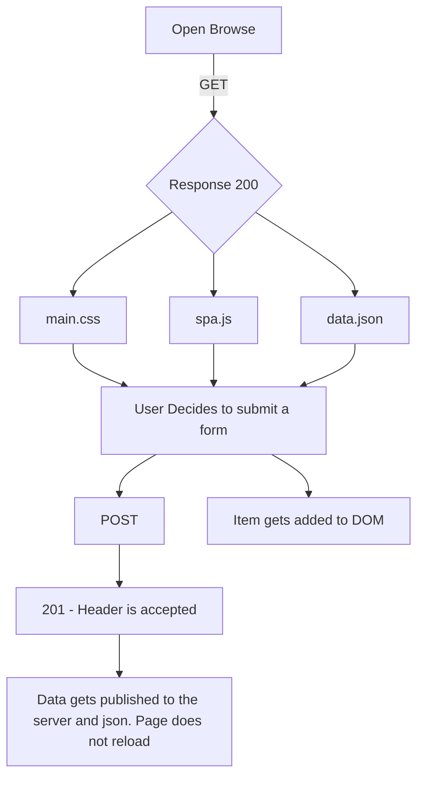

```mermaid
%% I am so fed up with this syntax, it's pure cancer - however, I have to do this exercise:

flowchart TD
A[Open Browse] -->|GET| B{Response 200}
B--> G[main.css]
B --> H[spa.js]
B --> I[data.json]

            G --> J[User Decides to submit a form]
            H --> J
            I --> J

            J --> K[POST]
            J --> L[Item gets added to DOM]
            K --> M[201 - Header is accepted]
            M --> N[Data gets published to the server and json. Page does not reload]
```
